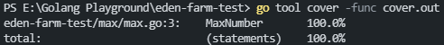

## Eden Farm Technical Test

1. Open this project with :
    ```sh
    cd eden-farm-test
    ```

2. Run this project :
    ```go
    go run main.go
    ```

3. To check coverage the function, run this command in terminal : 
    ```go
    go test ./... -coverprofile cover.out
    ```

4. Screenshot from coverage result :
    <br />
    
    